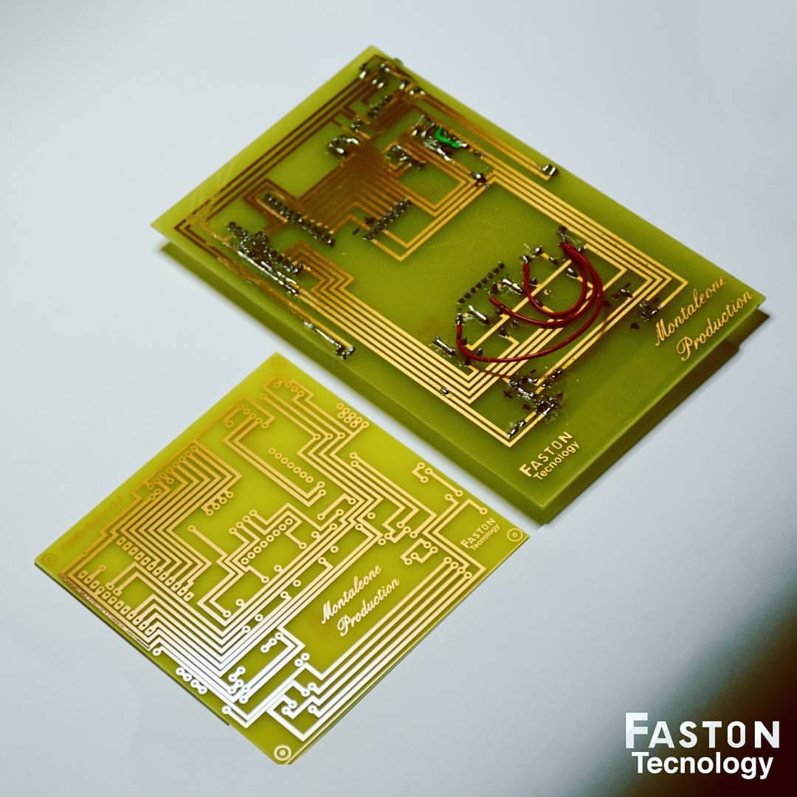
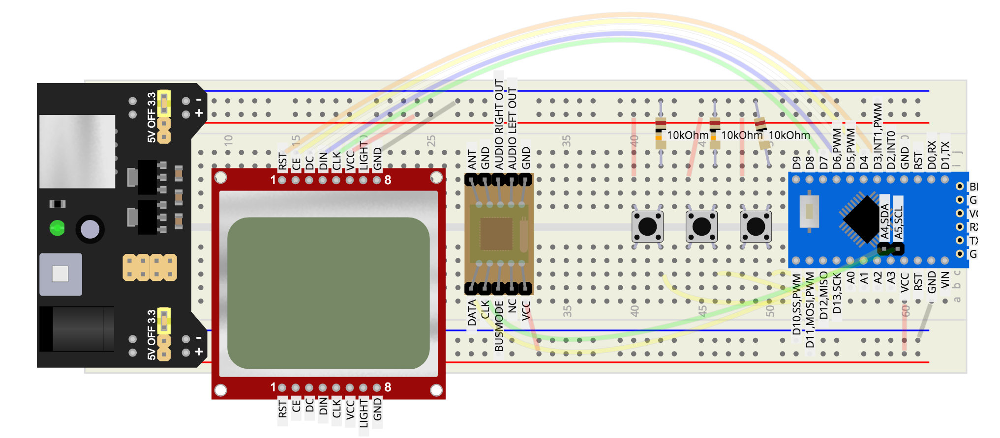
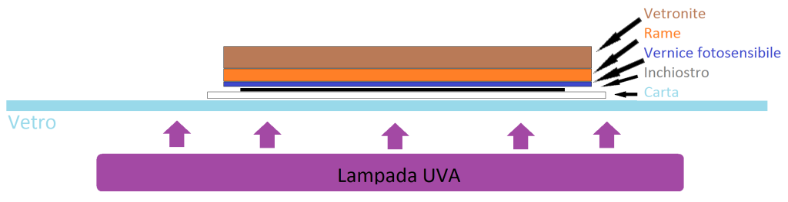
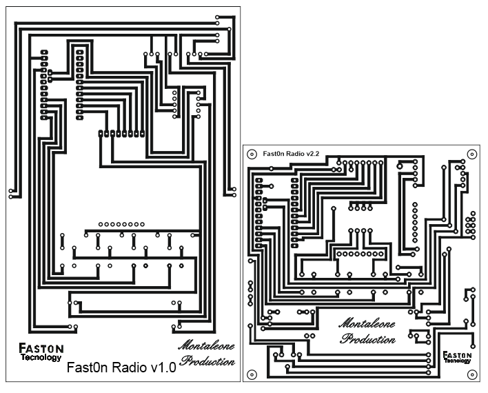

# Fast0n Radio - Maturità 2016

## Idea
La radio è stata pensata con il concetto di modularità ovvero che ogni singolo componente, tranne alcuni di scarso costo, possono essere sostituiti facilmente in caso di rottura/guasto.

Prende spunto dal vecchio progetto made in Google ovvero "Project ARA" che aveva come idea la modularità di un dispositivo mobile.

## Componenti usati
- Un Arduino Pro mini;
- Un LCD Nokia 5110;
- Un alimentatore variabile da 3.3/5v;
- Un amplificatore 5V;
- Un jack femmina da 3,5mm;
- Un modulo orologio RTC I2C DS1307;
- Un modulo per le frequenze radio Philips TEA5767;
- Un regolatore di tensione 5v>3,3v;
- Due altoparlanti 3w 4ohm;
- Quattro resistenze da 10ohm e 4 da 3,9ohm, un diodo e 4 pulsanti.

## Realizzazione
La realizzazione di questo progetto parte dall'esecuzione di test fatti su una breadboard per controllare il corretto funzionamento di ogni singolo componente con il software creato.

Fatti i test, si passa alla realizzazione di un PCB (circuito stampato) non utilizzando una CNC (Macchina a controllo numerico) ma bensì con il processo di sublimazione. 
 

Per lo schema del PCB è stato utilizzato CorelDraw (Software per la grafica vettoriale), creando lo schema e poi stampato su una pellicola trasparente in speculare.

